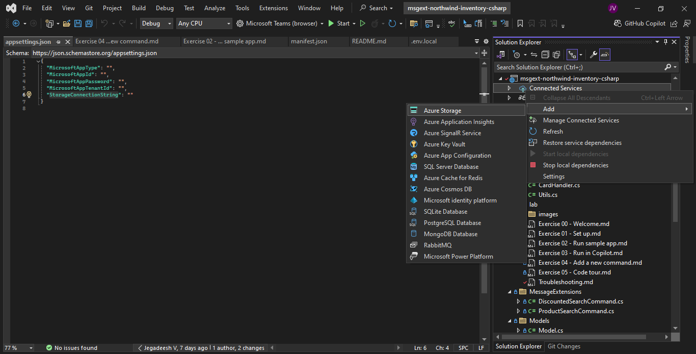
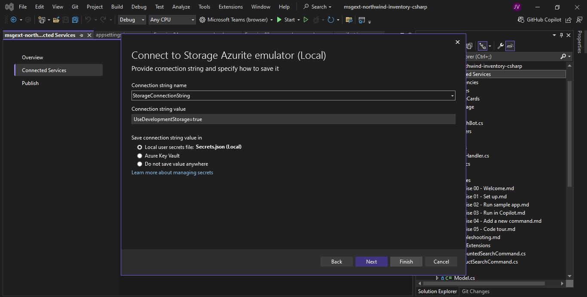
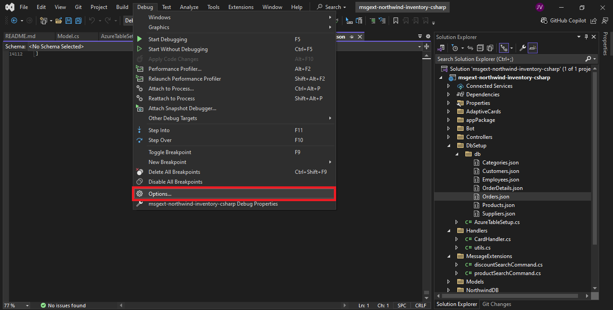
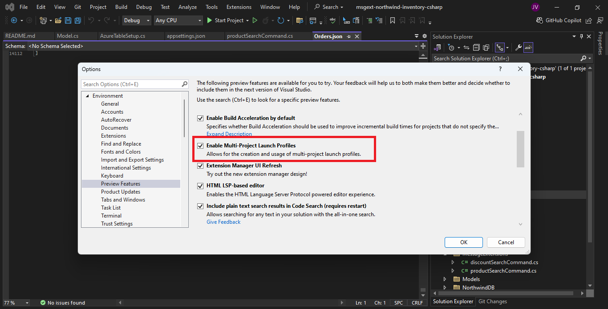
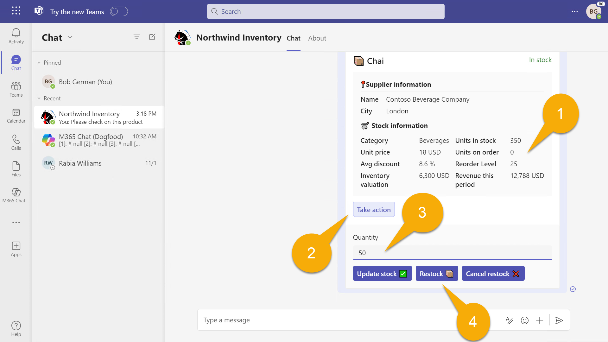
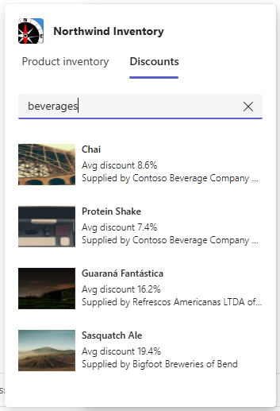
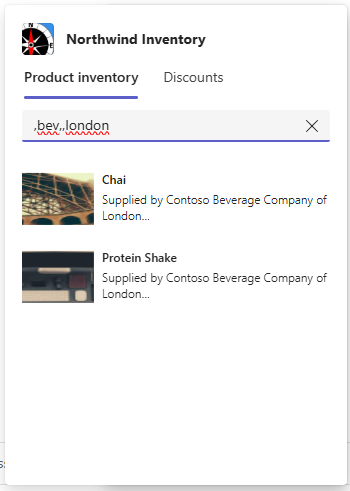
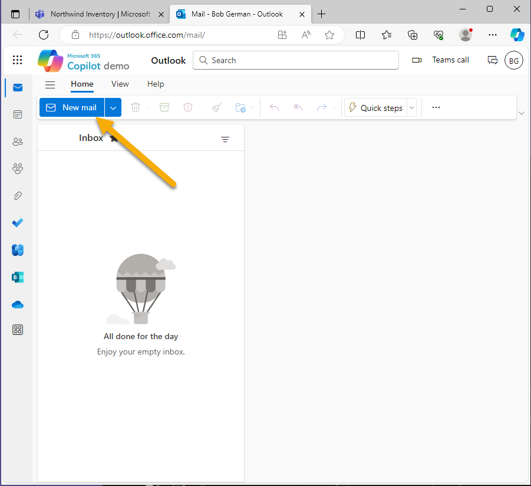
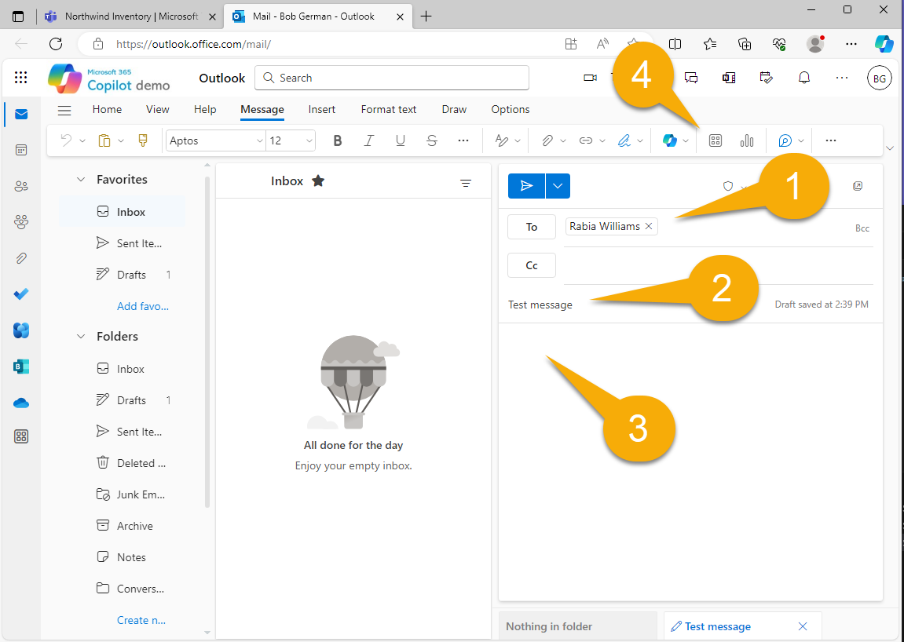
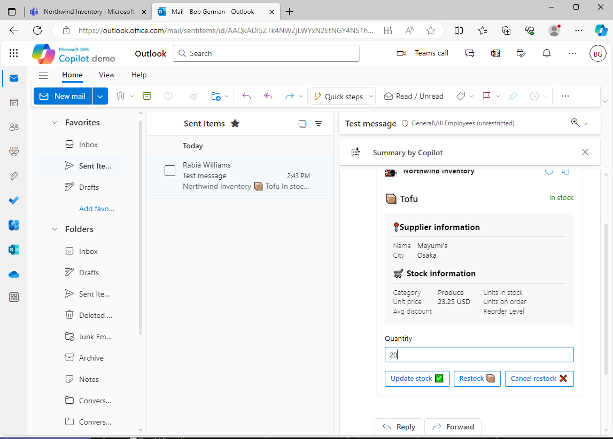

# Building Message Extensions for Microsoft Copilot for Microsoft 365

TABLE OF CONTENTS

* [Welcome](./Exercise%2000%20-%20Welcome.md) 
* [Exercise 1](./Exercise%2001%20-%20Set%20up.md) - Set up your development Environment 
* Exercise 2 - Run the sample as a Message Extension **(THIS PAGE)**
* [Exercise 3](./Exercise%2003%20-%20Run%20in%20Copilot.md) - Run the sample as a Copilot plugin
* [Exercise 4](./Exercise%2003%20-%20Add%20a%20new%20command.md) - Add a new command
* [Exercise 5](./Exercise%2005%20-%20Code%20tour.md) - Code tour

## Exercise 2 - Run the sample as a Message Extension

## Step 1 - Set up the project for first use

Open your working folder in Visual Studio.

Teams Toolkit stores environment variables in the **env** folder, and it will fill in all the values automatically to **appsettings.json** when you start your project the first time. However there's one value that's specific to the sample application, and that's the connection string for accessing the Northwind database.

In this project, the Northwind database is stored in Azure Table Storage; when you're debugging locally, it uses the [Azurite](https://learn.microsoft.com/azure/storage/common/storage-use-azurite?tabs=visual-studio%2Cblob-storage#running-azurite-from-an-aspnet-project) storage emulator. That's mostly built into the project, but the project won't build unless you provide the connection string.

The necessary setting is provided in a file **appsettings.sample.json** under msgext-northwind-inventory-csharp project. Copy the **"StorageConnectionString": "UseDevelopmentStorage=true"** value from this file, and add it to **appsettings.json**. This is where secret or sensitive settings are stored.

The resulting **appsettings.json** file should be similar to the one below:

~~~text
{
    "MicrosoftAppType": "{Some value}",
    "MicrosoftAppId": "{Some value}",
    "MicrosoftAppPassword": "{Some value}",
    "MicrosoftAppTenantId": "{Some value}",
    "StorageConnectionString": "UseDevelopmentStorage=true"
}
~~~

- Running Azurite from an ASP.NET project

Right-click on "Connected Services" in Solution Explorer and select **Add** from the dropdown menu. Choose **Azure Storage**.

Select service dependency **Storage Azurite emulator(local)** and click **Next**.

Provide connection string name as **StorageConnectionString** and click **Finish**.

When the configuration completes, select Close, and the Azurite emulator starts automatically. The output looks similar to the following screenshot.

- Enable Multi-Project Launch Profiles

Click the "Debug" menu in Visual Studio and then select "Options".

Navigate to Environment > Preview Features and check the checkbox labeled "Enable Multi-Project Launch Profiles".

## Step 2 - Run the application locally

Click F5 to start debugging, or click the start button 1️⃣. Make sure that the debug profile is **Microsoft Teams (browser)** 2️⃣.

> Note : Running this sample for the first time may prompt you to trust the ASP.NET Core SSL Certificate. In that case, click "Yes".

Once you're in, Microsoft Teams should open up and display a dialog offering to install your application.
Take note of the information displayed; which is from the [app manifest](../TeamsApp/appPackage/manifest.json).

Click "Add" to add Northwind Inventory as a personal application.

You should be directed to a chat within the application, however you could use the app in any chat.

## Step 3 - Test in Microsoft Teams

In any Teams chat - including the Northwind Inventory chat - begin typing a message 1️⃣ that refers to a product. Then, to insert an adaptive card for the product, click the + 2️⃣ . In the fly-up panel, select the Northwind Inventory application you just installed 3️⃣ .

You will see a search dialog with 3 tabs 1️⃣. The "Product Inventory" tab allows searching for products by name; for now, just type a product name, or the beginning of a product name such as "chai" into the search box 2️⃣ . If you pause as you type the first letters, you'll be given more choices of products that begin with the same characters.

Click Chai 3️⃣ to insert an adaptive card into the conversation along with your comment.

You can see the card, but you can't use it until you send it. Make any final edits to your message and click "Send".

> NOTE: Card actions won't work until you send the card. If you get an error, please check and make sure you've sent the message and are working with the card after it has been sent.

> NOTE: This is really only useful in conversations with other users; the chat in the Northwind Inventory app is just for testing.

Notice that there is no chai on order 1️⃣ . The authors of this lab are big chai drinkers and they may be stopping by so you'd better order more! Click the "take action" button 2️⃣ to open a child card. Enter a quantity 3️⃣ and click the "Restock" button 4️⃣ . The card will refresh with (hopefully) a success message and an updated number of units on order.

You can cancel the order or modify the stock levels using the other two buttons.

## Step 4 - Advanced queries

Back in Visual Studio, have a look at the app manifest, which is in a file called **manifest.json** in the **appPackage** directory. You'll notice that the app information that was displayed when you installed the app is all here.

Scroll down a bit to `composeExtensions:`.
Compose extensions is the historical name for a message extension; the Northwind Inventory message extension is defined here.

Here's an abbreviated version of that JSON for easy reference.

~~~json
"composeExtensions": [
    {
        "botId": "${{BOT_ID}}",
        "commands": [
            {
                "id": "inventorySearch",
                ...
                "description": "Search products by name, category, inventory status, supplier location, stock level",
                "title": "Product inventory",
                "type": "query",
                "parameters": [ ... ]
            },
            {
                "id": "discountSearch",
                ...
                "description": "Search for discounted products by category",
                "title": "Discounts",
                "type": "query",
                "parameters": [ ...]
            }
        ]
    }
],
~~~

Notice first that there's a bot ID. That's because Microsoft Teams uses the Azure bot channel to exchange secure, real-time messages with your application. Teams Toolkit will register the bot and fill in the ID for you.

Then there's a collection of commands. These correspond to the tabs in the search dialog in Teams. In this application, the commands are really intended for Copilot more than regular users!

You already ran the first command when you searched for a product by name. You can try the other one now.

Enter "Beverages", "Dairy", or "Produce" into the "Discounts" tab, and you'll see the products within those categories that are discounted. Copilot will use this to answer questions about discounted products.

Now examine the first command again. You'll notice it has 5 parameters!

~~~json
"parameters": [
    {
        "name": "productName",
        "title": "Product name",
        "description": "Enter a product name here",
        "inputType": "text"
    },
    {
        "name": "categoryName",
        "title": "Category name",
        "description": "Enter the category of the product",
        "inputType": "text"
    },
    {
        "name": "inventoryStatus",
        "title": "Inventory status",
        "description": "Enter what status of the product inventory. Possible values are 'in stock', 'low stock', 'on order', or 'out of stock'",
        "inputType": "text"
    },
    {
        "name": "supplierCity",
        "title": "Supplier city",
        "description": "Enter the supplier city of product",
        "inputType": "text"
    },
    {
        "name": "stockQuery",
        "title": "Stock level",
        "description": "Enter a range of integers such as 0-42 or 100- (for >100 items). Only use if you need an exact numeric range.",
        "inputType": "text"
    }
]
~~~

Unfortunately, Teams can only display the first parameter, but Copilot can use all 5. This will allow it to do more advanced queries of the Northwind inventory data.

As a work-around to the Teams UI limitation, in the "Northwind Inventory" tab, the application will accept up to 5 parameters comma separated, using the format:

~~~text
name,category,inventoryStatus,supplierCity,supplierName
~~~

Read the descriptions in the JSON above carefully when entering a query. Try entering these, and as you do, keep an eye on the debug console tab in Visual Studio, where you'll see each query as it's run.

* "chai" - find products with names that begin with "chai
* "c,bev" - find products in categories beginning with "bev" and names that begin with "c
* ",,out" - find products that are out of stock
* ",,on,london" - find products that are on order from suppliers in London
* "tofu,produce,,osaka" - find products in the "produce" category with suppliers in Osaka and names that begin with "tofu"

Each query term filters the list of products down. The format of each query term is arbitrary - just be sure to explain it to Copilot in the description of each parameter.

## Step 5 - Test in Microsoft Outlook (Optional)

Let's take a brief detour so you can see how message extensions work in Microsoft Outlook.

First, click the "Waffle" menu 1️⃣ and select "Outlook" 2️⃣ .

Click the "New mail" button to begin composing a message.

Add a recipient 1️⃣ and a subject 2️⃣ , and position your cursor in the body of the message 3️⃣ . You can even type something. When you're ready, click the app button in the toolbar 4️⃣ .

Select the Northwind Inventory application, searching if necessary to find it.

Now you can search for "Chai" 1️⃣ as before and select it to insert the adaptive card 2️⃣ .

Note that the adaptive card won't work until you send the message. If the recipient doesn't have Microsoft Outlook, they won't be able to view the card, and if they don't have the Northwind Inventory app installed, they won't be able to take action on it.

## Step 6 (optional) - View Northwind database in Azure Storage Explorer

The Northwind Database isn't fancy but it's real! If you want to peek at or even modify the data, open the Azure Storage Explorer while Azurite is running. (Running the app starts Azurite automatically).

To view the Northwind data, open "Emulator & Attached", "Storage Accounts", "Emulator - Default Ports", and "Tables". There you'll see the old Northwind database tables, which aren't nearly as handy in a NO SQL environment, but there they are!

The code reads the Products table on each query, but the other tables are only accessed when the app starts. So if you want to add a new category, you'll need to restart the app for it to appear.

## Congratulations

You have completed Exercise 2.
Please proceed to [Exercise 3](./Exercise%2003%20-%20Run%20in%20Copilot.md) in which you will run the sample application in Microsoft Copilot for Microsoft 365!
